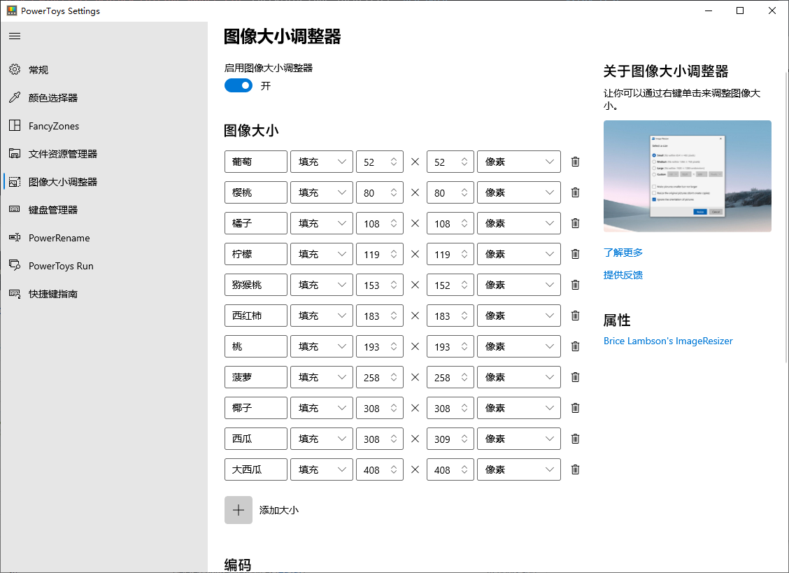

# 合成周杰伦

本项目谨用于实验、学习和娱乐，请勿商用。

本项目基于 [合成大西瓜源代码](https://github.com/liyupi/daxigua) 修改制作。

## 开发调试

1. 移动到项目根目录

2. 运行serve

   ```shell
   serve
   ```

## 功能修改

需要修改的文件主要为以下：

1. index.html —— 主页面
2. ./src/extraSettings.js —— 抽出的部分设置
3. ./src/project.js —— 主要游戏逻辑
4. ./src/settings.js —— 部分设置逻辑
5. ./res/* —— 游戏资源文件

### 小工具系列

由于替换资源的麻烦，为了便利，我使用了一些小工具，也做了一些小工具：

1. [大西瓜改图工具](https://daxigua-tools.liyupi.com/)

   这个工具是在我clone的源项目的README文档里面发现的，很方便的打包，但是图片的数据会被上传到服务器，所以有隐私图片需要打包的请慎重。

2. [Microsoft PowerToys](https://github.com/microsoft/PowerToys/)

   这个工具是我为了格式化图片尺寸的时候使用的工具

   

   在预先设定好图片的尺寸后，就能通过该工具快速修改图片尺寸。

3. circle

   这是工具是我为了切割图片为圆形，在参考了一些python脚本后，自己实现的一个自动切圆py脚本。

## 发布

将修改好的本项目打包发布到静态资源服务器即可。